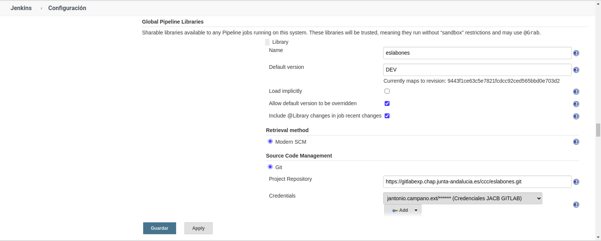
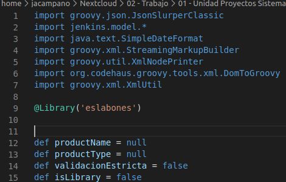

## Eslabones

_Funciones que dan soporte a CadenaUnica_

## ¿Qué es Eslabones?

Eslabones es un conjunto de funciones que dan soporte a las tareas a realizar en CadenaUnica (Pipeline). Estás funciones encapsulan la funcionalidad a implementar, facilitando la reutilización y lectura del Pipeline principal.

## Instalación

Como paso previo para utilizar la librería, es necesario registrarla en la configuración de Jenkins. Para ello, como administrador, accedemos a "Administrar Jenkins -> Configurar el sistema" y rellenamos el siguiente formulario con la información necesaria:

* *Library Name:* Nombre que le daremos a la librería (desde el Pipeline se referenciará mediante @Library('Library Name'))
* *Default version:* Versión por defecto a utilizar
* *Propiedades del repositorio GIT:* Las propiedades necesarias para el repositorio GIT (URL/Credenciales/Rama etc)



## Uso 

Una vez se ha realizado el registro en la configuración de Jenkins, para hacer uso de la librería solo será necesario referenciarla desde el Pipeline de la siguiente forma:

```
@Library('Library Name')
```

Por ejemplo, si a nuestra libreria la hemos llamado eslabones, en nuestro pipeline deberemos referenciarla:

```
@@Library('eslabones')
```



## Funciones existentes

### AnalisisOWASP.groovy

Lanza el análisis de depdencias de la aplicación vía plugin Owasp Dependency Check. La opción para el formato de salida esta fijada a "ALL" y la instalación utilizada de OWASP Dependency Check es DC-5.2.4 


### AnalisisOWASPPublicarResultados.groovy

Realiza la publicación de resultados de OWASP Dependency Check vía plugin dependencyCheckPublisher

### AnalisisSonar.groovy

Lanza el análisis con SonarQube, utilizando la instalación "SonarScanner". El plugin buscará el fichero sonar.properties en ${WORKSPACE}/sonar.properties

### BuscarProyectoEnGIT.groovy

Devuelve una lista de proyectos de Gitlab que coincide con el nombre de producto pasado


### ConstruirImagenDocker.groovy

Realiza la contrucción de la imagén a partir del fichero Dockerfile proporcionado. De forma adicional, se realiza la subida de la imagén generada al registro Harbor https://harbor.chie.junta-andalucia.es. El etiquetado de la imagén en dicho registro se realiza de las siguientes etiquetas:

* Con la versión del producto, en caso de que se trate de una entrega. Ejemplo "3.2.0"
* Con la versión del producto + "-" +  BUILD ID de la tarea en Jenkins, si es una version aún en desarrollo. Ejemplo "3.2.0-SNAPSHOT-22" (si no se trata de una entrega, siempre tiene que tener en versión -SNAPSHOT)
* Con la etiqueta 'latest'

### ConstruirImagenOKD.groovy

Realiza la construcción y despliegue de la imagen en OKD


### DescargarArtifactory.groovy

Realiza la descarga de artefactos necesarios desde Artifactory. 


### DesplegarArtifactory.groovy

Realiza el despliegue de los artefactos generados a Artifactory. Se utilizan los dos siguientes repositorios

* ja-ci-deploy-snapshots : Para subidas dentro de circutio de integración continua (versiones en desarrollo)
* ja-artifacts-deploy : Para subidas de artefactos pertenecientes a entregas

### DesplegarContenedor.groovy

Paso intermedio para realizar el despliegue en plataforma de contenedores. Se realiza la selección de la plataforma, para posteriormente, llamar a la función necesaria que complete el despliegue.

### DesplegarImagenEnClusterKubernetes.groovy

Realiza el despliegue de la imagen indicada en cluster de Kubernetes.

### DesplegarServidorAplicaciones.groovy

Realiza el despliegue del war suministrado en los servidores de aplicaciones configurados (en Consul) para el proyecto.

### EnvioInformeArtifactory.groovy

Envío notificación vía email del resultado de la ejecución del paso subida a Artifactory

### EnvioInformeOWASP.groovy

Envío notificación vía email del resultado de la ejecucion de análisis de depencias con OWASP Dependency Check. Se adjunta fichero dependency-check-report.html 

### EnvioInformePruebasFuncionales.groovy

Envío notificación vía email del resultado de la ejecución de las pruebas funcionales automatizadas. Para el FWKAPIs, se envía de forma adicional el informe generado en fichero "informe.zip"

### EnvioInformePruebasFuncionalesSOAPUI.groovy

Envío notificación vía email del resultado de la ejecución de pruebas funcionales automatizadas con SOAP-UI . En un futuro, se fusionará con función EnvioInformePruebasFuncionales.groovy


### EnvioInformeSonar.groovy

Envío notificación vía email del resultado de la ejecución del análisis con sonar.

### EnvioLogCorreo.groovy

Envío notificación vía email del log de la tarea Jenkins ejecutada

### EnvioNotificacionDespliegue.groovy

Envío notificación vía email del resultado del despliegue automatizado

### EnvioNotificacionEquipoCalidad.groovy

Envío notificación vía email al equipo de Calidad

### EnvioNotificacionEquipoProduccion.groovy

Envío notificación vía email al equipo de Calidad

### EnvioNotificacionInicio.groovy

Envío notificación vía email del inicio del proceso de integración/entrega continua

### GeneracionSite.groovy

Lanza la tarea para la generación del site del proyecto

### LimpiarRepositorio.groovy

Lanza la limpieza del repositorio local de librerías.

### ObtenerCodigoFuente.groovy

Realiza la descarga del código fuente del proyecto desde el repositorio de código.

### ObtenerConfiguracion.groovy

(Obsoleto) Obtiene la configuración del servidor de Consul. Se ha marcado como obsoleto, ya que se han creado dos funciones por separados, una para la obteción de configuración de entorno y otra la obtención de la configuración del pipeline. Se eliminará en futuras versiones.

### ObtenerConfiguracionEntorno.groovy

Obtiene la configuracion del entorno desde Consul

### ObtenerConfiguracionPipeline.groovy

Obtiene la configuración del pipeline desde Consul

### ObtenerDesplegables.groovy

Función que devuelve todos los desplegables encontrados en el proyecto en una lista seleccionable 

### ObtenerlistadoProductos.groovy

Obtiene una lista de productos desde el servidor de configuración

### ObtenerURLRepositorio.groovy

Obtiene la URL del repositorio en Gitlab a partir del productID


### PreguntaContinuarDespliegue.groovy

En intervenciones manuales, presenta la pregunta correspondiente en cada una de las fases.

### PruebasUnitarias.groovy

Realiza el lanzamiendo de las pruebas unitarias

### PublicacionSite.groovy

Realiza la publicación del site

### QualityGate.groovy

Lanza el proceso de espera para obtener el umbral de calidad desde Sonar.

### RealizarPruebasFWKAPIs.groovy

Prepara y lanza la ejecución de las pruebas automatizadas vía FWKAPIs

### RealizarPruebasFWKE2E.groovy

Prepara y lanza la ejecución de las pruebas automatizadas vía FWKE2E

### RealizarPruebasFuncionalesSOAPUI.groovy

Prepara y lanza la ejecución de las pruebas automatizadas vía SOAP-UI

### RealizarPruebasFuncionalesSelenium.groovy

Prepara y lanza la ejecución de las pruebas automatizadas vía Selenium

### SelectorConfirmacionProducto.groovy

Selector de confirmación para el producto (para cuando existe más de una coincidencia en Gitlab para el nombre del producto)

### SelectorEntorno.groovy

Selector del entorno

### SelectorPkataforma.groovy

Selector de la plataforma a utilizar en el despligue

### SelectorProducto.groovy

Selector para el producto producto

### SelectorVersion.groovy

Selector para la versión

### eslabonMaven.groovy

Realiza la compilación y empaquetado vía maven

### info.groovy

Muestra en pantalla diversa información de contexto al inicio de la ejecución.


